# Multi-API Server Demo

**Author:** [Matthew Cameron Kriel](https://matthewkriel.com)

A comprehensive Go-based API server demonstrating 7 different API paradigms with multiple database backends. This project serves as a learning resource for understanding various API architectures and data storage patterns.

## API Types

- **REST API** - HTTP methods (GET, POST, PUT, DELETE) with JSON payloads
- **SOAP API** - XML-based messaging protocol with strict standards and WSDL
- **gRPC API** - High-performance RPC using Protocol Buffers and HTTP/2
- **GraphQL API** - Query language for precise data fetching from single endpoint
- **WebSocket API** - Full-duplex real-time communication over persistent connections
- **WebRTC API** - Peer-to-peer communication for video, audio, and data
- **Webhook API** - HTTP callbacks for event-driven system notifications

## Project Architecture

```mermaid
graph TB
    subgraph "API Layer"
        REST[REST API<br/>HTTP + JSON]
        SOAP[SOAP API<br/>XML + WSDL]
        GRPC[gRPC API<br/>Protocol Buffers]
        GraphQL[GraphQL API<br/>Query Language]
        WS[WebSocket API<br/>Real-time]
        WebRTC[WebRTC API<br/>P2P Communication]
        Webhook[Webhook API<br/>Event Callbacks]
    end

    subgraph "Service Layer"
        UserSvc[User Service]
        ProductSvc[Product Service]
        OrderSvc[Order Service]
        DealershipSvc[Dealership Service]
        SessionSvc[Session Service]
    end

    subgraph "Repository Layer"
        UserRepo[User Repository]
        ProductRepo[Product Repository]
        OrderRepo[Order Repository]
        CustomerRepo[Customer Repository]
        VehicleRepo[Vehicle Repository]
        SalespersonRepo[Salesperson Repository]
        SaleRepo[Sale Repository]
        SessionRepo[Session Repository]
        CacheRepo[Cache Repository]
    end

    subgraph "Database Layer"
        MongoDB[(MongoDB<br/>E-commerce Data)]
        MySQL[(MySQL<br/>Car Dealership)]
        Redis[(Redis<br/>Cache & Sessions)]
    end

    subgraph "Legend"
        Completed[Completed]
    end

    REST --> UserSvc
    REST --> ProductSvc
    REST --> OrderSvc
    SOAP --> DealershipSvc
    GRPC --> UserSvc
    GraphQL --> UserSvc
    GraphQL --> ProductSvc
    WS --> SessionSvc
    WebRTC --> SessionSvc
    Webhook --> UserSvc

    UserSvc --> UserRepo
    ProductSvc --> ProductRepo
    OrderSvc --> OrderRepo
    DealershipSvc --> CustomerRepo
    DealershipSvc --> VehicleRepo
    DealershipSvc --> SalespersonRepo
    DealershipSvc --> SaleRepo
    SessionSvc --> SessionRepo
    SessionSvc --> CacheRepo

    UserRepo --> MongoDB
    ProductRepo --> MongoDB
    OrderRepo --> MongoDB
    CustomerRepo --> MySQL
    VehicleRepo --> MySQL
    SalespersonRepo --> MySQL
    SaleRepo --> MySQL
    SessionRepo --> Redis
    CacheRepo --> Redis

    %% Database styling (keep original database colors)
    style MongoDB fill:#4DB33D
    style MySQL fill:#00758F
    style Redis fill:#DC382D

    %% Completed components (green stroke and fill)
    classDef completed fill:#E8F5E8,stroke:#28a745,stroke-width:3px,color:#155724
    classDef pending fill:#FFF3CD,stroke:#ffc107,stroke-width:2px,color:#856404

    %% Apply completed styling to implemented components
    class UserRepo,ProductRepo,OrderRepo,MongoDB completed
    class CustomerRepo,VehicleRepo,SalespersonRepo,SaleRepo,MySQL completed
    class SessionRepo,CacheRepo,Redis completed
    
    %% Apply pending styling to not-yet-implemented components
    class UserSvc,ProductSvc,OrderSvc,DealershipSvc,SessionSvc pending
    class REST,SOAP,GRPC,GraphQL,WS,WebRTC,Webhook pending

    %% Legend styling
    style Completed fill:#E8F5E8,stroke:#28a745,stroke-width:3px,color:#155724
```



### Database Layer
The application uses three different databases, each optimized for different use cases:

- **MongoDB** - Document-based storage for e-commerce data (users, products, orders)
- **MySQL** - Relational database for car dealership management
- **Redis** - In-memory cache for sessions and fast data access

### Repository Pattern
All database interactions use the repository pattern for clean separation of concerns and easy testing.

## API Implementation Details

### 1. REST API
**What it is:** Representational State Transfer - Uses HTTP methods (GET, POST, PUT, DELETE) with JSON payloads.

**How it works:** Each resource has a URL endpoint. HTTP methods determine the action:
- `GET /users` - Retrieve all users
- `POST /users` - Create new user
- `PUT /users/123` - Update user 123
- `DELETE /users/123` - Delete user 123

### 2. SOAP API
**What it is:** Simple Object Access Protocol - XML-based messaging protocol with strict standards.

**How it works:** Uses XML envelopes for requests/responses. Includes WSDL (Web Service Description Language) for service contracts. More formal and structured than REST.

### 3. gRPC API
**What it is:** Google Remote Procedure Call - High-performance, language-neutral RPC framework using Protocol Buffers.

**How it works:** Define services in `.proto` files, generate client/server code. Uses HTTP/2 for transport, binary serialization for speed. Supports streaming and bidirectional communication.

### 4. GraphQL API
**What it is:** Query language and runtime for APIs that allows clients to request exactly the data they need.

**How it works:** Single endpoint receives queries specifying desired data structure. Clients can fetch multiple resources in one request, avoiding over-fetching or under-fetching data.

### 5. WebSocket API
**What it is:** Full-duplex communication protocol over a single TCP connection.

**How it works:** Establishes persistent connection between client and server. Both parties can send messages at any time. Perfect for real-time applications like chat, live updates, or gaming.

### 6. WebRTC API
**What it is:** Web Real-Time Communication - Enables peer-to-peer communication for video, audio, and data.

**How it works:** Establishes direct connections between clients after initial signaling through server. Used for video calls, file sharing, and real-time collaboration.

### 7. Webhook API
**What it is:** HTTP callbacks that notify external systems when events occur.

**How it works:** Server sends POST requests to registered URLs when specific events happen (user created, order processed, etc.). Enables event-driven architectures and system integrations.

## Getting Started

### Prerequisites
- Go 1.21+
- Docker and Docker Compose

### Setup
1. Start databases:
   ```bash
   docker-compose up -d
   ```

2. Seed databases:
   ```bash
   go run cmd/seed/main.go --all
   ```

3. Run the server:
   ```bash
   go run cmd/server/main.go
   ```

## Project Structure
```
├── cmd/
│   ├── seed/           # Database seeding utilities
│   └── server/         # Main application server
├── internal/
│   ├── models/         # Database-specific models
│   │   ├── mongodb/    # E-commerce models
│   │   ├── mysql/      # Car dealership models
│   │   └── redis/      # Cache/session models
│   ├── repository/     # Data access layer
│   ├── services/       # Business logic layer
│   └── handlers/       # API endpoint handlers
└── docker-compose.yml  # Database containers
```

## Learning Objectives

This project demonstrates:
- Multiple API paradigms and their use cases
- Database-specific modeling and optimization
- Repository pattern for clean architecture
- Go best practices for API development
- Docker containerization for development
- Testing strategies for different API types

Each API type showcases different strengths and is suitable for different scenarios, providing a comprehensive understanding of modern API development approaches.
